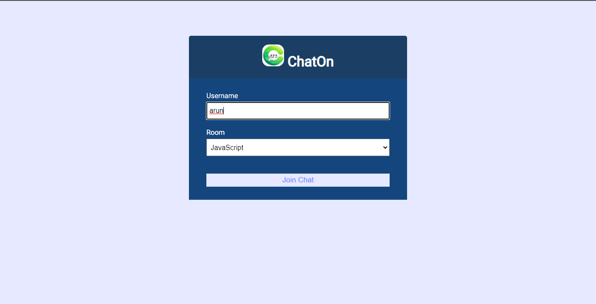
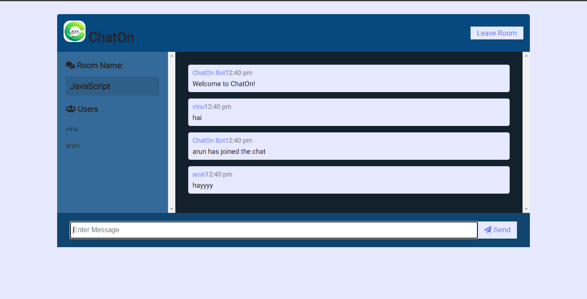

# chating-app-chat-on-

# Chat App

### A real-time chat application built using Node.js, Express, Redis, and Socket.IO.

# Getting Started
- These instructions will get you a copy of the project up and running on your local machine for development and testing purposes.

## Prerequisites
- You need to have Node.js and npm installed on your machine.

### Installing
1. Clone the repository to your local machine.

`git clone https://github.com/<your-username>/chat-app.git`

2. Change the working directory to the cloned repository.
`cd chat-app`

3. Install the dependencies.
`npm install`

## Running the app
Start the app by running the following command.

`npm start`

### Open your browser and visit `http://localhost:3000/` to view the app.

# Built With

- [Express](https://expressjs.com/) - A fast, minimal and flexible Node.js web application framework.

- [Socket.IO](https://socket.io/) - A real-time communication library for building event-driven applications.

- [Redis](https://redis.io/)  - An in-memory data structure store used as a database, cache, and message broker.

it's  sample chating app  img;

## **Author**

## [Harshad](https://harshad4321githubio-production.up.railway.app/)- Initial work

## License
This project is licensed under the ISC License 

